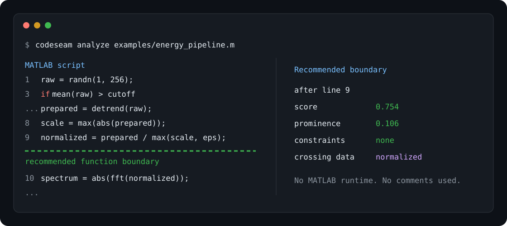

# CodeSeam

**Find natural function boundaries in long scripts.**

[](https://github.com/forbbit/codeseam/actions/workflows/ci.yml)
[](https://www.python.org/)
[](LICENSE)
[](https://www.mathworks.com/products/matlab.html)

CodeSeam is a deterministic, explainable static analyzer that finds places where a
long MATLAB script can naturally become separate functions.



```bash
uvx --from git+https://github.com/forbbit/codeseam codeseam analyze your_script.m
```

```text
Recommended boundaries:
  script:top-level after line 9, score=0.754
    local peak: True, prominence=0.106
    cross: normalized
    constraints: -
```

The example above is committed at [`examples/energy_pipeline.m`](examples/energy_pipeline.m)
and can be reproduced locally. CodeSeam only suggests boundaries: it never executes
MATLAB code and never rewrites the input file.

## Why CodeSeam?

Splitting a script at every blank line, comment section, or locally high score creates
too many fragments. CodeSeam instead asks whether adjacent statements form coherent
modules and chooses a globally compatible set of seams.

- **Semantic, not cosmetic:** comments, `%%` sections, blank lines, and formatting are
  deliberately excluded from every scoring decision.
- **Explainable:** every candidate reports its score, prominence, data crossing the
  seam, extraction constraints, risks, and adjacent module quality.
- **Globally selected:** dynamic programming chooses a continuous partition instead
  of accepting independent local peaks.
- **Project-aware:** an optional project index resolves calls into other `.m` files.
- **No MATLAB required:** parsing uses Tree-sitter; source is analyzed, never executed.
- **Designed to grow:** MATLAB semantics live in one frontend while the IR, CFG/PDG,
  scoring, and selection core remain language-neutral.

## Status

CodeSeam is an experimental MATLAB-first release. It supports analysis and
suggestions, not automatic function extraction. Treat recommendations as review
targets, especially around dynamic workspace behavior and ambiguous calls.

## Quick start

Python 3.11 or newer is required. Run the latest GitHub revision without cloning:

```bash
uvx --from git+https://github.com/forbbit/codeseam codeseam analyze path/to/script.m
```

Or install a local checkout with [uv](https://docs.astral.sh/uv/):

```bash
git clone https://github.com/forbbit/codeseam.git
cd codeseam
uv sync --extra dev
uv run codeseam analyze examples/energy_pipeline.m
```

PyPI packages and standalone binaries are planned but are not published yet.

## Commands

Analyze a single script:

```bash
codeseam analyze path/to/script.m
codeseam analyze path/to/script.m --json analysis.json
```

Explain a legal boundary:

```bash
codeseam explain path/to/script.m --after-line 120
```

Build project context so external and local MATLAB calls can be resolved:

```bash
codeseam project-scan path/to/project --json project-index.json
codeseam analyze path/to/project/script.m --project-index project-index.json
```

The JSON report includes scores, normalized and raw features, dependency crossings,
module quality, constraints, risks, prominence, and selection reasons.

## How it works

```text
.m source
  -> Tree-sitter MATLAB frontend
  -> language-neutral executable-region IR
  -> control-flow and program-dependence graphs
  -> semantic boundary features and extraction constraints
  -> adjacent-module quality
  -> global dynamic-programming selector
  -> ranked, explainable recommendations
```

See [Architecture](docs/ARCHITECTURE.md), [Features](docs/FEATURES.md), and
[Selection](docs/SELECTION.md) for the definitions and formulas.

## Benchmark

The frozen v0.1 configuration scores the held-out synthetic test split as follows:

| Scripts | Precision | Recall | F1 | Forbidden cuts | Excess cuts |
| ---: | ---: | ---: | ---: | ---: | ---: |
| 100 | 0.667 | 0.667 | 0.667 | 0.000 | 0.000 |

These are reproducible regression metrics over generated structural families—not a
claim of real-project accuracy. The generator covers scripts mixed with local
functions, loops, branches, external calls, workspace effects, large interfaces,
and adversarial candidate peaks. See the complete [benchmark protocol and
limitations](docs/BENCHMARKS.md).

## Reproducible corpus workflow

> **V2 validation freeze:** formal structured training is currently disabled.
> `train-structured` exits without fitting until all gates in
> `reports/TRAINING_READINESS_GATE.md` pass. Architecture validation remains
> available through the finite-loss/gradient and Soft/Hard-DP smoke tests.

Generated and downloaded corpora are intentionally not committed.

```bash
codeseam corpus generate corpus/generated --count 340 --seed 1729
codeseam corpus audit corpus/generated
codeseam corpus evaluate corpus/generated --split test
codeseam corpus train corpus/generated --artifact weights/generated.json
codeseam corpus tune-selection corpus/generated \
  --weights weights/generated.json --artifact weights/selection.json
```

The real-project registry contains full commit SHAs and license metadata. Downloads
remain local:

```bash
codeseam corpus registry corpus/real-projects.json
codeseam corpus fetch-real corpus/real-projects.json corpus/real-downloaded
```

## Validation

```bash
uv run pytest
uv run ruff check src tests
uv build
```

Synthetic metrics are regression diagnostics, not a production accuracy claim.
Real-project model annotations are kept separate from training until independently
reviewed.

## Current limits

- MATLAB scripts are the only supported input language today.
- Recommendations identify seams but do not generate function signatures or edits.
- Dynamic MATLAB behavior (`eval`, workspace mutation, ambiguous call/index syntax)
  can only be represented as constraints or risks by static analysis.
- Independent human annotation of the pinned real-project set is still needed.

See the [roadmap](docs/ROADMAP.md) for the planned validation, reporting, packaging,
editor integration, and additional language work.

## Contributing

See [CONTRIBUTING.md](CONTRIBUTING.md). Bug reports should include the smallest
comment-free executable example that reproduces the behavior when possible.

## License

MIT. See [LICENSE](LICENSE). Third-party repositories listed in the corpus registry
are not redistributed by this repository and retain their own licenses.
